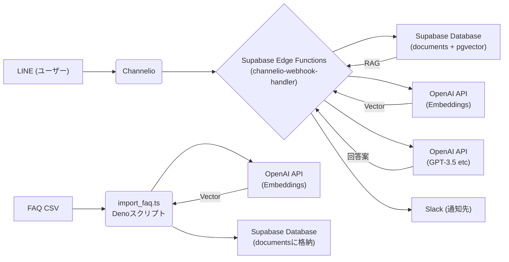

# yeni-auto-answer

Channelioに届いた問い合わせに対して、FAQデータを元に自動回答案を生成するシステムです。ユーザーからのLINEメッセージがChannelioを経由して届くと、OpenAIのAPIを使って関連するFAQ情報を検索し、適切な回答案を生成してSlackに通知します。

## 概要

このプロジェクトは以下の機能を提供します：

1. **顧客問い合わせの自動応答案生成**：顧客からLINE経由で来た問い合わせに対し、事前に登録したFAQやナレッジベースを活用して回答案を自動生成
2. **オペレーター支援**：生成された回答案はSlackに送信され、オペレーターが確認・活用できる
3. **FAQ管理**：CSVファイルからFAQデータをベクトル化してデータベースに格納

## システム構成


*Note: Mermaid diagrams might not render perfectly in all Markdown viewers.*

## 主要コンポーネント

### 1. Supabase Edge Function: `channelio-webhook-handler`

Channelioからのwebhookを受け取り、問い合わせ内容を処理してSlackに通知します。

- **場所**: `supabase/functions/channelio-webhook-handler/index.ts`
- **機能**:
  - Channelioからのwebhookリクエスト受信
  - 問い合わせ内容の抽出とベクトル化 (OpenAI Embeddings)
  - pgvectorを使った関連FAQ検索
  - カスタマイズされたプロンプトを使ったAI回答案の生成 (OpenAI Chat Completions)
  - Slackへの通知

### 2. ベクトル検索用データベース

FAQデータを検索可能な形で格納するSupabase PostgreSQLデータベース。

- **テーブル**: `documents`
- **フィールド**: `id`, `content`, `question`, `source_type`, `embedding`, `created_at`, `updated_at`
- **拡張機能**: `pgvector`

### 3. FAQインポートスクリプト

CSVファイルからFAQデータを読み込み、ベクトル化してデータベースに格納します。

- **場所**: `import_faq.ts`
- **実行方法**: `deno run --allow-read --allow-net --allow-env import_faq.ts`

## セットアップ方法

### 前提条件

- Supabaseアカウントとプロジェクト (DBに`pgvector`拡張が有効であること)
- OpenAI APIキー
- Slack Botトークンと通知用チャンネルID (通常用・エラー用)
- ChannelioアカウントとWebhook設定
- Deno (ローカル開発用: `brew install deno` or via official installer)
- Supabase CLI (`brew install supabase/tap/supabase` or `npm i -g supabase`)

### インストール手順

1. **リポジトリのクローン**:
   ```bash
   git clone https://github.com/bikkkubo/yeni-auto-answer.git
   cd yeni-auto-answer
   ```

2. **Supabase CLI ログインとリンク**:
   ```bash
   supabase login
   supabase link --project-ref <YOUR-PROJECT-REF>
   ```

3. **データベースのセットアップ**:
   - Supabase SQLエディタで `reset_documents_table.sql` の内容を実行します。

4. **環境変数の設定 (Supabase Secrets)**:
   - `supabase/.env` ファイルを作成または編集し、以下のキーと値を記述します。
     ```dotenv
     OPENAI_API_KEY=sk-...
     SLACK_BOT_TOKEN=xoxb-...
     SLACK_CHANNEL_ID=C...
     SLACK_ERROR_CHANNEL_ID=C...
     # SUPABASE_URL, SUPABASE_ANON_KEY は通常不要 (自動設定)
     ```
   - 以下のコマンドでSupabaseにSecretsを設定します。
     ```bash
     supabase secrets set --env-file ./supabase/.env
     ```
   - **重要:** `.gitignore` に `supabase/.env` が含まれていることを確認してください。

5. **Edge Functionのデプロイ**:
   ```bash
   supabase functions deploy channelio-webhook-handler --no-verify-jwt
   ```

6. **FAQデータのインポート**:
   - FAQ情報をCSVファイル (`yeni_faq.csv`) に整理します (ヘッダー行: `Question,Answer`)。
   - `import_faq.ts` ファイルを開き、`OPENAI_API_KEY` と `SUPABASE_KEY` (Service Role Key) を実際の値に更新します。
   - スクリプトを実行:
     ```bash
     deno run --allow-read --allow-net --allow-env import_faq.ts
     ```

7. **Channelio Webhook設定**:
   - Channelioの管理画面 > Webhook管理 でWebhookを作成または編集します。
   - URLにデプロイされたSupabase Functionのエンドポイント (`https://<YOUR-PROJECT-REF>.supabase.co/functions/v1/channelio-webhook-handler`) を指定します。
   - トリガーしたいイベント（例: 新規接客チャットの受信時）を選択します。

## ファイル説明

- `supabase/functions/channelio-webhook-handler/index.ts`: メインのWebhook処理を行うEdge Function。
- `supabase/functions/_shared/cors.ts`: CORS設定用の共有ファイル。
- `import_faq.ts`: ローカルで実行するFAQインポート用Denoスクリプト。
- `reset_documents_table.sql`: `documents`テーブルと`match_documents`関数を準備するSQL。
- `README_FAQ_IMPORT.md`: FAQインポートスクリプトの詳細な手順。
- `README.md`: 本ファイル（プロジェクト全体の説明）。
- `yeni_faq.csv`: FAQデータのサンプル（実際のデータに置き換えてください）。
- `.gitignore`: Gitで追跡しないファイル（`.env`など）を指定。

## 使用技術

- **言語/ランタイム**: TypeScript, Deno
- **プラットフォーム**: Supabase (Edge Functions, Database, Auth, Secrets)
- **データベース**: PostgreSQL + `pgvector`拡張
- **AI**: OpenAI API (Embeddings API, Chat Completions API)
- **外部連携**: Channelio (Webhook), Slack (API)

## 注意事項

- OpenAI APIの使用にはコストが発生します。料金体系を確認してください。
- Supabaseのプランによっては、Functionの実行時間やDBリソースに制限があります。
- APIキーやトークンなどの機密情報は、`.env`ファイルに記述し、絶対にGitリポジトリにコミットしないでください。

## ライセンス

[ライセンス情報を記述] 